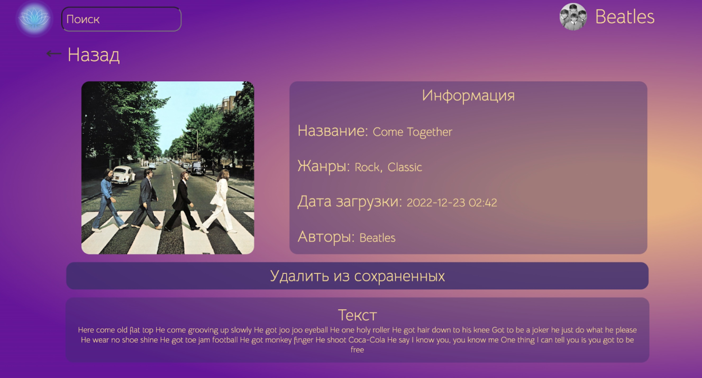
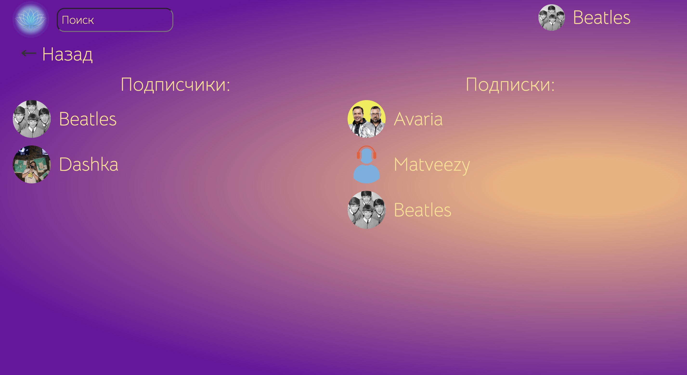
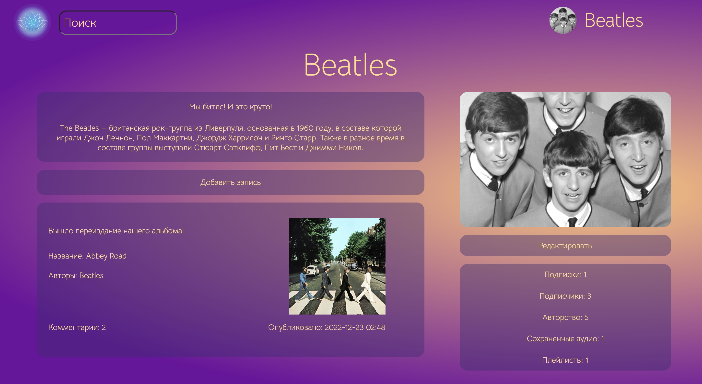
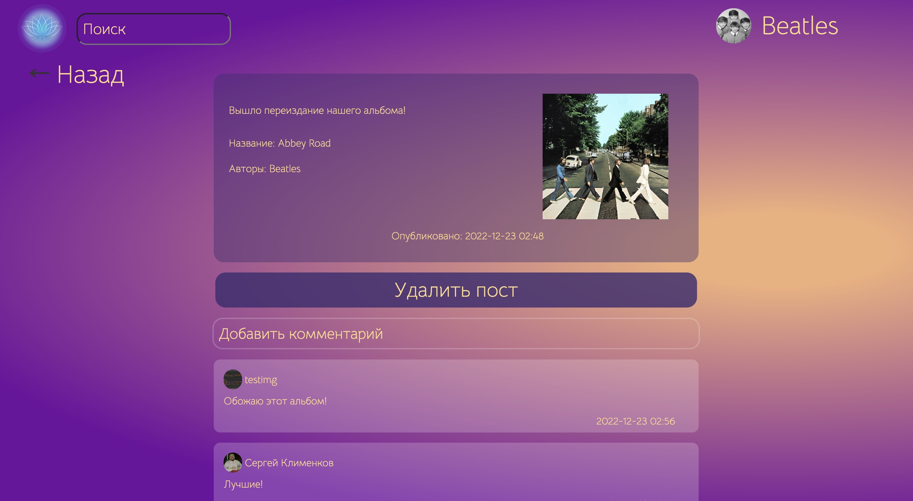
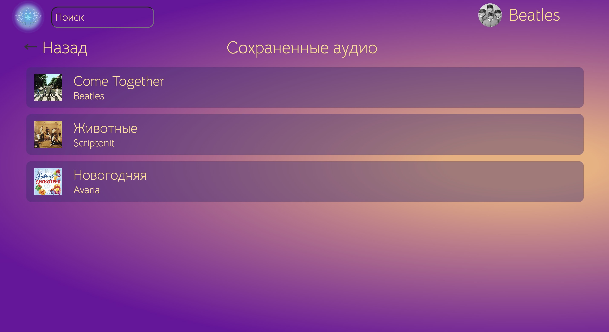
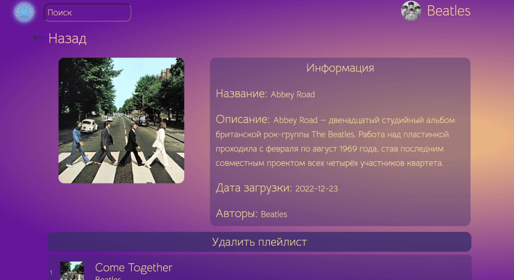
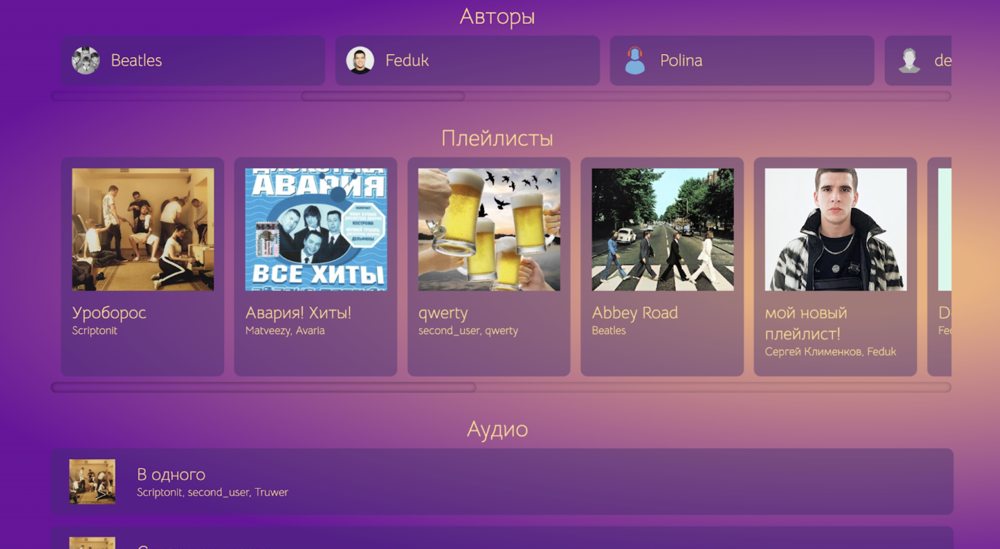

# Eupho music

Для запуска сервиса требуется скачать проект, а также по пути ```/euph-music/src/main/resources ``` добавить файл _application.properties_ который содержит:
```
spring.datasource.url=jdbc:postgresql://localhost:5432
spring.datasource.username=*username
spring.datasource.password=*password

spring.jpa.properties.hibernate.jdbc.lob.non_contextual_creation=true
spring.jpa.properties.hibernate.dialect=org.hibernate.dialect.PostgreSQLDialect
spring.jpa.hibernate.ddl-auto=validate
spring.jpa.show-sql=true
spring.jpa.properties.hibernate.format_sql=true
spring.jpa.open-in-view=false

spring.datasource.driver-class-name=org.postgresql.Driver

spring.freemarker.exposeRequestAttributes=true
spring.freemarker.suffix=.ftl
spring.freemarker.templateLoaderPath=classpath:/templates/
```

Вместо *username и *password необходимо ввести свои логин и пароль от СУБД соответственно.

При первом запуске необходимо запустить [скрипт](SQL/code/creating_tables.sql) для создания таблиц в СУБД.

Для корректного отображения всех медиа-файлов сервиса необходимо [здесь](euph-music/src/main/java/com/racers/euphmusic/utils/StringUtils.java) заменить ```~``` на абсолютный путь до папки с хранилищем.

### Описание бизнес-процессов

Для доступа к контенту платформы человек должен __войти__ или __зарегистрироваться__ 


При загрузке __аудио__ пользователь выбирает жанр, добавляет текст


__Пользователи__ могут __подписываться__ друг на друга


В __профиле__ отображается количество и список подписок и подписчиков


Пользователи могут публиковать __посты__ на своей странице и любой пользователь может оставлять к ним __комментарии__


У каждого пользователя есть свой список __“сохраненные аудио”__


Из списка “сохраненные аудио” или  “авторство”  пользователь может создавать свои __плейлисты__ с заданным названием и возможностью добавить описание


Поиск осуществляется по имени пользователя, названию аудио или названию плейлиста



