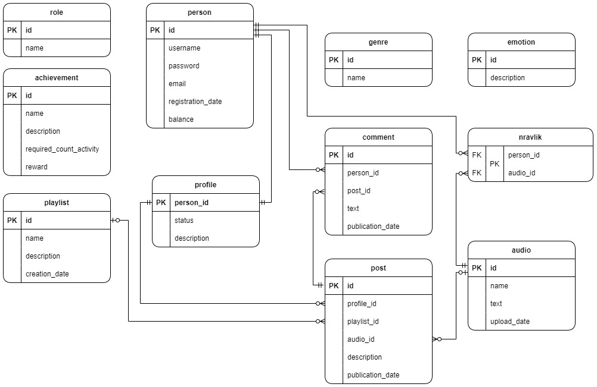
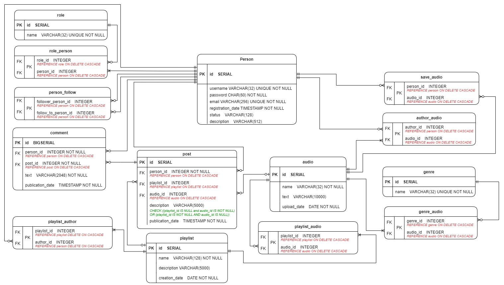

## Описание предметной области

Существует платформа для размещения музыки. Есть __пользователи__, каждый из которых может загружать свои __аудиофайлы__ в разных __жанрах__.
Также, __пользователи__ могут, слушать __аудио__, загруженные другими пользователями, добавлять их в список __“сохраненные композиции”__, объединять их в __плейлисты__, делиться __аудио__ или __плейлистами__ в профиле, оставлять __комментарии__ к таким __записям__.
На платформе существует возможность поиска. Также у каждого __аудио__ есть текст, который виден __пользователям__.

- Сервис взаимодействует с СУБД PostgreSQL
- Логика бизнес-процессов реализована с помощью [триггеров](code/triggers.sql) и [функций](code/functions.sql)
- Для повышения эффективности работы сервиса добавлены [индексы](code/indexes.sql)

## Модели
### ER-модель проекта

### Даталогическая модель

